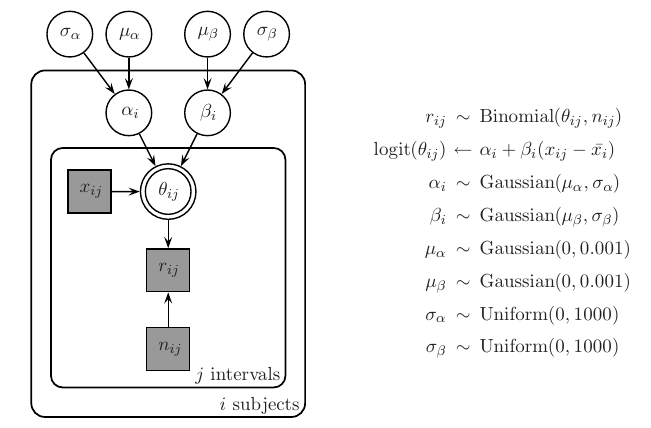
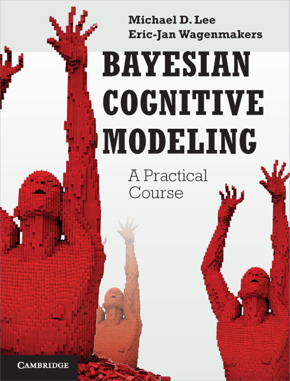
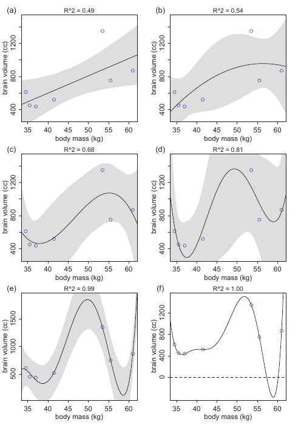

```{r setup, include=FALSE}
knitr::opts_chunk$set(echo = FALSE)
```

## JAGS

- Just Another Gibbs Sampler <a href="http://mcmc-jags.sourceforge.net/">http://mcmc-jags.sourceforge.net/</a>
- Is a program for analysis of Bayesian hierarchical models using Markov Chain Monte Carlo (MCMC)
- Gibbs sampling is a MCMC method of sampling based on sequential updating of conditional parameter distributions (see chapter 7 of DBDA by Kruschke)
- the name JAGS is somewhat misleading: JAGS consists of many MCMC samplers, beyond Gibbs sampler (e.g. slice sampling, Metropolis alghorithm)

## JAGS

See code - next page.



## JAGS

```
model{
  for (i in 1:nsubjs){
    for (j in 1:nstim[i]){
      r[i,j] ~ dbin(thetalim[i,j],n[i,j])
      logit(thetalim[i,j]) <- lthetalim[i,j]
      lthetalim[i,j] <- min(999,max(-999,ltheta[i,j]))
      ltheta[i,j] <- alpha[i]+beta[i]*(x[i,j]-xmean[i])
    }
    beta[i] ~ dnorm(mub,lambdab)
    alpha[i] ~ dnorm(mua,lambdaa)
  }
  # Priors
  mub ~ dnorm(0,.001)
  mua ~ dnorm(0,.001)
  sigmab ~ dunif(0,1000)
  sigmaa ~ dunif(0,1000)
  lambdab <- pow(sigmab,-2)
  lambdaa <- pow(sigmaa,-2)
}
```

## JAGS

- we will use JAGS because of its high flexibility and easy implementation of even very complicated models
- *practical hint 1*: don't fret that you will have to think how to program your own models, in most of the cases you can use premade templates, that you will only have to adjust to your needs

## Books about JAGS for psychologists {.flexbox .vcenter}

</img>

\begin{center}
\includegraphics[width=8in]{kruschke2.jpg}
\end{center}

## Books about JAGS for psychologists {.flexbox .vcenter}

</img>

\begin{center}
\includegraphics[height=6in]{bcm2.jpg}
\end{center}

## What are information criteria?

- When you model some data, your aim is to make predictions about future observed values of the data
- You usually find best model by minimizing *deviance* - the error that you make by using a certain model to predict some data, i.e. the lower the deviance the better the model.
- There is a small issue with this approach: You could potentially add as many parameters as possible, up to the point where you would make no error at all.
- E.g. instead of using 1 mean for the whole populations you could make a model where each person has it's own parameter, this would make a best fitted model.

## What are information criteria? {.flexbox .vcenter}

</img>

\begin{center}
\includegraphics[width=8in]{overfit.png}
\end{center}

## What are information criteria?

- The problem is that in this way you would model not only interesting part - a signal - but also some individual random processes - noise.
- When trying to make predictions on another group of people, your fit would be definitely not the best.
- This is because you have *overfitted* the model, it is not generalizable. You have trained and tested the model on the same data.
- The better approach would be to train model one sample of people, and then to test it on another sample - to *cross-validate* it.

## What are information criteria?

- Luckily you don't always have to find two samples to create your model.
- Even with one sample, you can approximate the prediction error resulting from the fact that you are training and testing the model on the same data, and penalize your deviance by this prediction error.
- It occurs that this prediction error is proportional to the number of parameters in your model.
- Recall adjusted $R^2$ from linear regression models - it uses the same logic, however it can be be only applied to a specific class of models (OLS), we need something more.
- There are many information criteria (probably $AIC$ is the most known) 
- Here we will use a version specific to Bayesian modeling - $DIC$ (deviance information criterion). 

